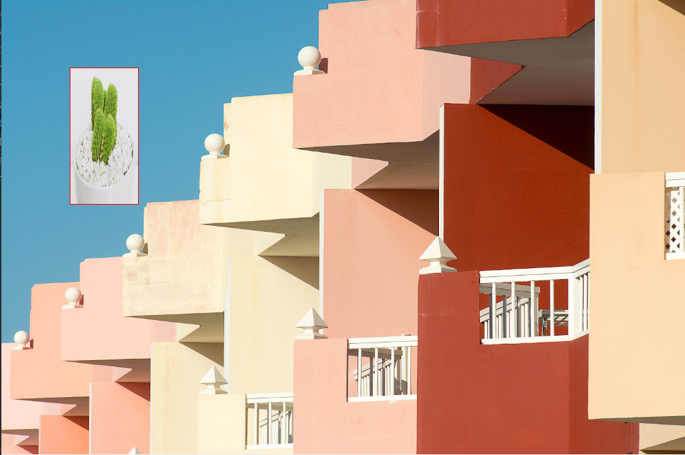
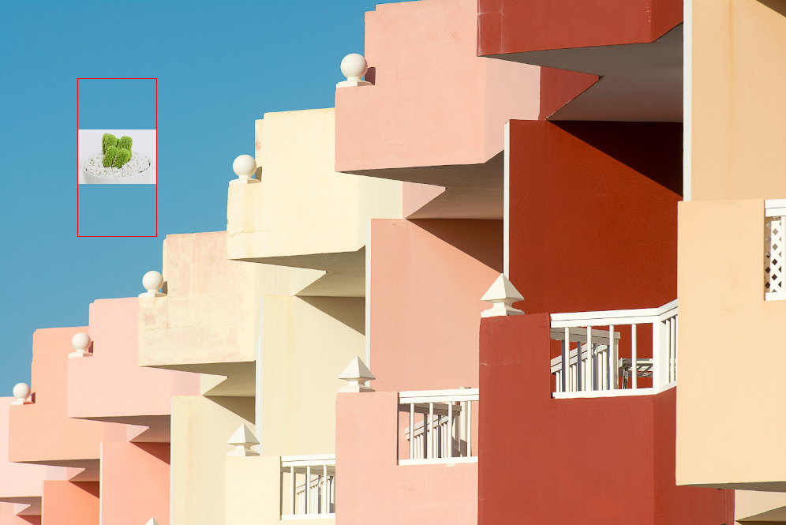
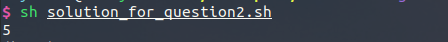

Wattman
====

AN implementation of Wattman code test.
-------

## Usage

Question 1:
```
python solution_for_question1.py    --json 'path/to/json' \
                                    --patch 'path/to/patch image' \
                                    --background, 'path/to/background image' \
                                    --mode 'fill or orig'
```

Question 2:
```
sh ./solution_for_question2.sh
```

## Demo

Below are results for question 1:

resize mode "stretch fill"
<div style="color:#0000FF" align="center">

</div>

resize mode "keep original proportion fill"
<div style="color:#0000FF" align="center">

</div>


Below are results for question 2:

<div style="color:#0000FF" align="center">

</div>

